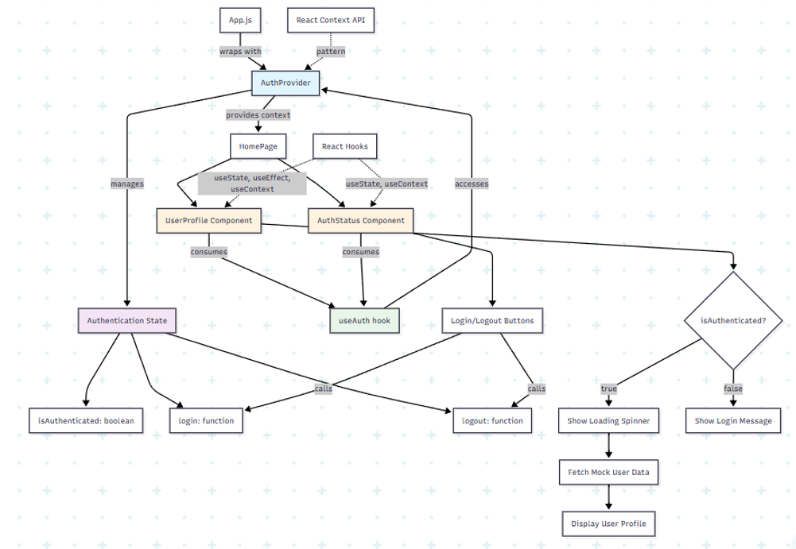

# [React Hooks: useEffect, useState, and useContext – A Complete Guide](https://www.freecodecamp.org/news/react-hooks-useeffect-usestate-and-usecontext/)

import React, { useState } from 'react';
import { Link } from 'react-router-dom';
import UserProfile from '../components/UserProfile';

const HomePage = () => {
  const [last_datetime, setLastDatetime] = useState(null);

  const handleButtonClick = () => {
    setLastDatetime(new Date().toISOString());
  };

  return (
    

      <h1 className="h3 fw-bold text-center text-dark mb-4">React Auth Demo</h1>
      

        <UserProfile />
        

          <Link 
            to="/auth-status" 
            state={{ last_datetime }}
            className="btn btn-outline-primary"
          >
            View Auth Status
          </Link>
        

      

      
      

        <button 
          className="btn btn-primary mb-2" 
          onClick={handleButtonClick}
        >
          Capture DateTime
        </button>
      

      
      

        This app demonstrates a simple authentication flow using React Context and Hooks.
      

    

  );
};

export default HomePage;

# Component Flow:

1.  **App.js** - Root component that wraps everything with `AuthProvider`.
2.  **AuthContext.js** - Creates and manages global authentication state:
    * `isAuthenticated` state
    * `login()` and `logout()` functions
    * Provides `useAuth` hook for easy access
3.  **HomePage.js** - Main page that renders both user components.
4.  **UserProfile.js** - Displays user information:
    * Checks authentication status via `useAuth`
    * Shows loading spinner → fetches mock data → displays profile
    * Shows login prompt if not authenticated
5.  **AuthStatus.js** - Authentication controls:
    * Uses `useAuth` to access login/logout functions
    * Shows current auth status and toggle buttons

The app uses React Context API to share authentication state across components without prop drilling, and demonstrates a typical authentication flow with loading states and conditional rendering.

# Getting Started with Create React App

This project was bootstrapped with [Create React App](https://github.com/facebook/create-react-app).

## Available Scripts

In the project directory, you can run:

### `npm start`

Runs the app in the development mode.\
Open [http://localhost:3000](http://localhost:3000) to view it in your browser.

The page will reload when you make changes.\
You may also see any lint errors in the console.

### `npm test`

Launches the test runner in the interactive watch mode.\
See the section about [running tests](https://facebook.github.io/create-react-app/docs/running-tests) for more information.

### `npm run build`

Builds the app for production to the `build` folder.\
It correctly bundles React in production mode and optimizes the build for the best performance.

The build is minified and the filenames include the hashes.\
Your app is ready to be deployed!

See the section about [deployment](https://facebook.github.io/create-react-app/docs/deployment) for more information.

### `npm run eject`

**Note: this is a one-way operation. Once you `eject`, you can't go back!**

If you aren't satisfied with the build tool and configuration choices, you can `eject` at any time. This command will remove the single build dependency from your project.

Instead, it will copy all the configuration files and the transitive dependencies (webpack, Babel, ESLint, etc) right into your project so you have full control over them. All of the commands except `eject` will still work, but they will point to the copied scripts so you can tweak them. At this point you're on your own.

You don't have to ever use `eject`. The curated feature set is suitable for small and middle deployments, and you shouldn't feel obligated to use this feature. However we understand that this tool wouldn't be useful if you couldn't customize it when you are ready for it.

## Learn More

You can learn more in the [Create React App documentation](https://facebook.github.io/create-react-app/docs/getting-started).

To learn React, check out the [React documentation](https://reactjs.org/).

### Code Splitting

This section has moved here: [https://facebook.github.io/create-react-app/docs/code-splitting](https://facebook.github.io/create-react-app/docs/code-splitting)

### Analyzing the Bundle Size

This section has moved here: [https://facebook.github.io/create-react-app/docs/analyzing-the-bundle-size](https://facebook.github.io/create-react-app/docs/analyzing-the-bundle-size)

### Making a Progressive Web App

This section has moved here: [https://facebook.github.io/create-react-app/docs/making-a-progressive-web-app](https://facebook.github.io/create-react-app/docs/making-a-progressive-web-app)

### Advanced Configuration

This section has moved here: [https://facebook.github.io/create-react-app/docs/advanced-configuration](https://facebook.github.io/create-react-app/docs/advanced-configuration)

### Deployment

This section has moved here: [https://facebook.github.io/create-react-app/docs/deployment](https://facebook.github.io/create-react-app/docs/deployment)

### `npm run build` fails to minify

This section has moved here: [https://facebook.github.io/create-react-app/docs/troubleshooting#npm-run-build-fails-to-minify](https://facebook.github.io/create-react-app/docs/troubleshooting#npm-run-build-fails-to-minify)
